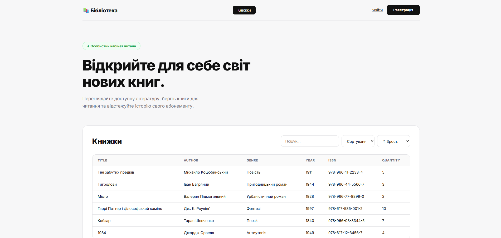
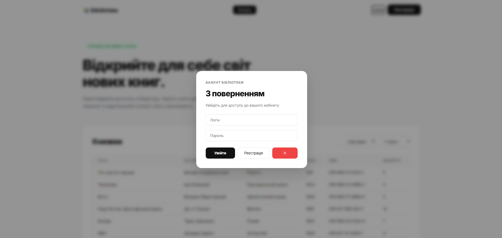
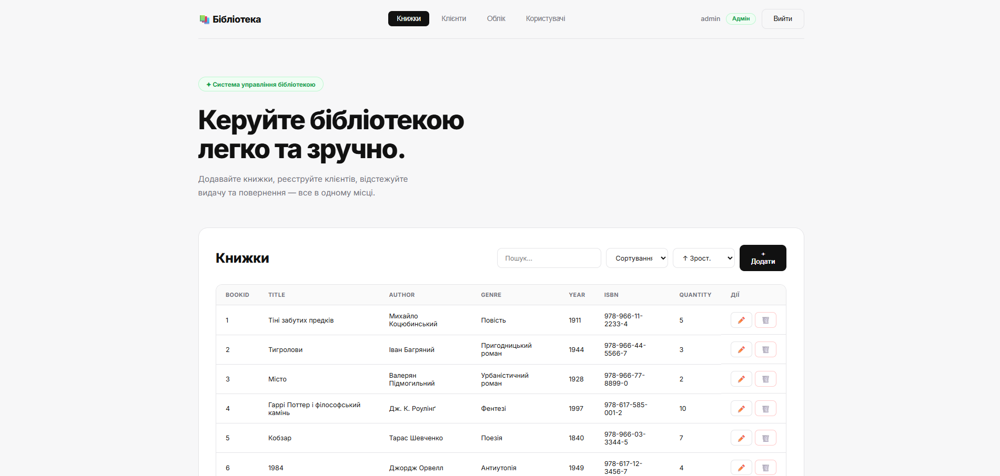
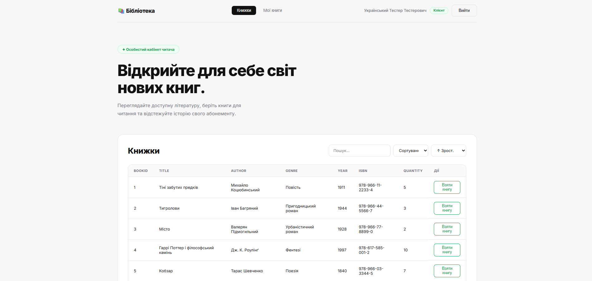
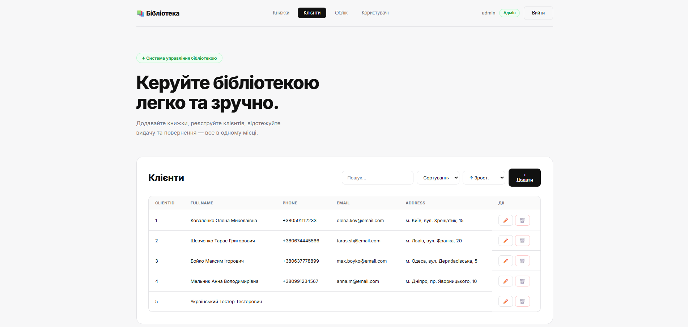
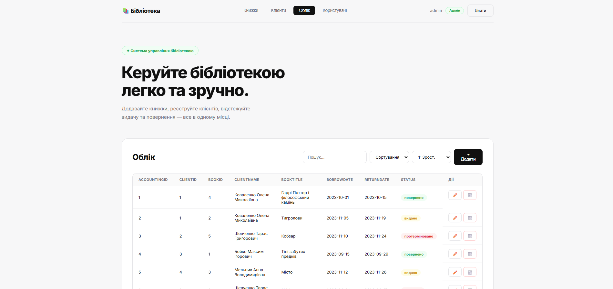
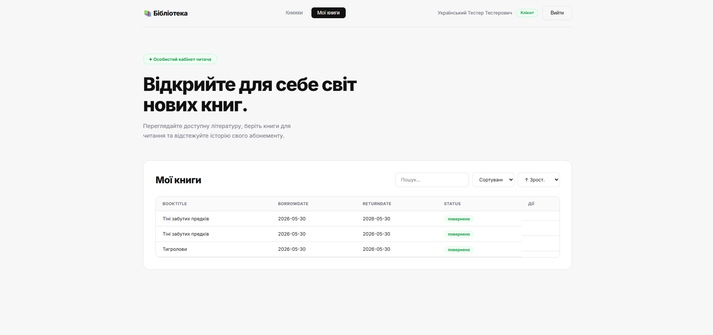
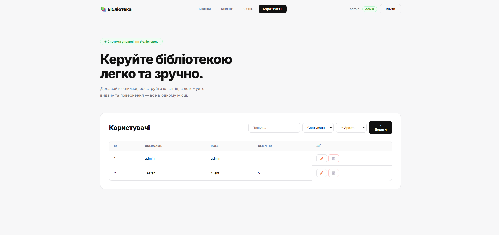

# Library Management System

## Назва
**Library Management System** — вебсистема для управління бібліотекою, каталогом книг, клієнтами (читачами) та обліком видачі/повернення книг.

## URL
**Live URL:** [https://libraryy.infinityfreeapp.com](https://libraryy.infinityfreeapp.com)

## Стек технологій

- **Frontend:** React (Vite)
- **Backend:** PHP REST API
- **База даних:** MySQL (PDO)
- **Хостинг:** InfinityFree
- **Авторизація:** JWT Token
- **Архітектура:** SPA + REST API

## Функції

Система забезпечує управління основними процесами бібліотеки:

- **Каталог книг:** додавання, редагування, видалення книг (назва, автор, жанр, рік, ISBN, кількість примірників).
- **Управління читачами:** збереження даних клієнтів (ПІБ, телефон, email, адреса). Автоматичне створення профілю клієнта при реєстрації.
- **Облік (Абонемент):** відстеження, хто яку книгу взяв, дати видачі та повернення, статус ("видано", "повернено", "протерміновано", "втрачено").
- **Автоматизація складу:** при взятті книги клієнтом кількість примірників автоматично зменшується, при поверненні — збільшується.
- **Особистий кабінет читача:** розділ "Мої книги" для клієнтів, де можна переглянути свої взяті книги та повернути їх в 1 клік.
- **Рольова система доступу:** Client та Admin. Інтерфейс автоматично підлаштовується під роль.
- **JWT авторизація:** захист приватних сторінок і API через токени.
- **REST API:** взаємодія React frontend з PHP backend через API (`api.php`).
- **Серверна обробка:** пошук, сортування та CRUD операції виконуються через PHP API та MySQL.

## Авторизація
**Сторінка авторизації:** Модальне вікно (Popup) на всіх сторінках.

Система використовує JWT token для захисту сесій користувачів. Токен передається як через заголовки, так і через URL-параметри для обходу обмежень безкоштовного хостингу.

### Ролі та доступ:

1. **Admin (Адміністратор):** має повний доступ до всіх таблиць. Може редагувати книги, клієнтів, керувати користувачами та переглядати повну таблицю обліку всіх читачів.
2. **Client (Клієнт):** має доступ до "Особистого кабінету читача". Може переглядати список доступних книг, самостійно "Взяти книгу", а також переглядати історію у розділі "Мої книги" та натискати "Здати" для повернення.

---

## Сторінки проекту

### 1. Головна сторінка
- **УРЛ:** `/` (автоматично перенаправляє на `/books`)
- **Опис:** Початкова сторінка сайту з доступом до каталогу книг.
- **Скріншот:**
  

### 2. Авторизація та Реєстрація
- **УРЛ:** Модальне вікно (Popup на будь-якій сторінці)
- **Опис:** Форма входу та створення нового акаунту. При реєстрації клієнта система автоматично створює для нього відповідний профіль у базі даних читачів. Після входу генерується JWT-токен.
- **Скріншот:**
  

### 3. Книжки (Books)
- **УРЛ:** `/books`
- **Опис:** Головний каталог бібліотеки. Адмін може додавати/редагувати книги. Клієнт бачить наявність і може натиснути кнопку "Взяти книгу" (якщо є в наявності).
- **Скріншот:**
  
  

### 4. Клієнти (Clients)
- **УРЛ:** `/clients`
- **Опис:** База даних читачів. Доступна тільки адміністратору.
- **Скріншот:**
  

### 5. Облік / Мої книги (Accounting)
- **УРЛ:** `/accounting`
- **Опис:** Для адміна — це повна таблиця "Облік" з усіма виданими книгами. Для клієнта — це розділ "Мої книги", де показані лише його книги з можливістю їх "Здати". Статуси красиво підсвічуються кольоровими тегами.
- **Скріншот:**
  
  

### 6. Користувачі (Users)
- **УРЛ:** `/users`
- **Опис:** Адміністративна сторінка керування акаунтами для входу.
- **Скріншот:**
  

# PHP API (Backend)

Усі API ендпоінти та логіка знаходяться у єдиному файлі:

```text
/api.php
```

JWT авторизація генерується вбудованими PHP-функціями `hash_hmac` всередині `api.php`.

---

## API Можливості

| Метод / Дія | Опис |
|---|---|
| GET `?resource=...` | Отримання даних таблиці (з пошуком і сортуванням) |
| POST `?resource=...` | Створення запису (тільки Admin) |
| PUT `?resource=...` | Редагування запису (тільки Admin) |
| DELETE `?resource=...`| Видалення запису (тільки Admin) |
| POST `?action=login` | Вхід користувача та генерація JWT токена |
| POST `?action=register`| Реєстрація нового клієнта (автоматично створює запис в `clients`) |
| POST `?action=borrow` | Взяття книги клієнтом (зменшує `Quantity` в `books`) |
| POST `?action=return` | Повернення книги клієнтом (збільшує `Quantity` в `books`) |

## Структура файлів на хостингу

```text
htdocs/
├── index.html              ← React SPA entry point
├── .htaccess               ← Rewrite rules для React Router (щоб не було помилок 404)
├── api.php                 ← PHP REST API
├── assets/
│   ├── index-***.js        ← Збірка React (JavaScript логіка)
│   └── index-***.css       ← Збірка стилів (Custom CSS)
```
